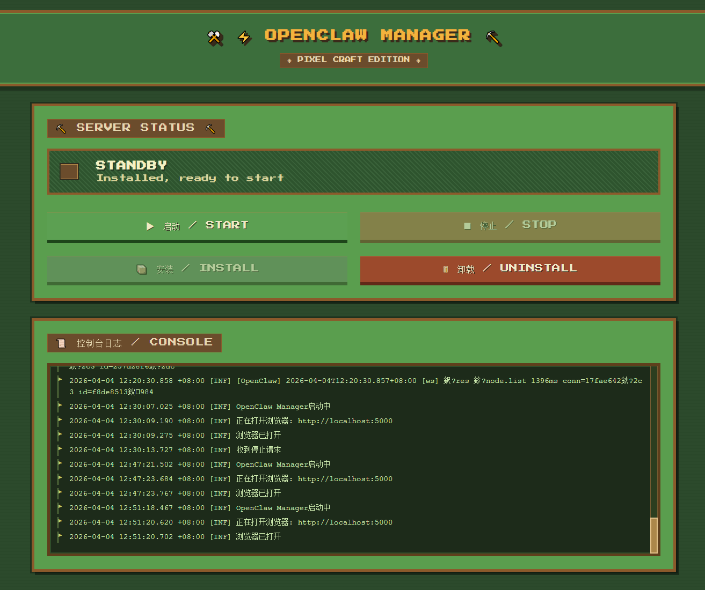

# 🦞 OpenClaw Manager

[](https://dotnet.microsoft.com/)
[](https://learn.microsoft.com/en-us/dotnet/core/deploying/native-aot/)
[](LICENSE)
[](https://github.com/lbwnb666-ai/OpenClawManager/pulls)

> 🖥️ 轻量级 · 跨平台 —— 一键管理你的 **OpenClaw** AI 网关服务

OpenClaw Manager 是一个基于 ASP.NET Core 开发的 Web 管理面板，为 [OpenClaw](https://github.com/yourname/OpenClaw) 提供图形化的一键安装、启动、停止、卸载和实时日志监控能力。


## ✨ 特性

- 🎮 **无痛安装** —— 双击exe即可安装openclaw，无需配置环境
- ⚡ **一键管理** —— 安装、启动、停止、卸载，全流程自动化
- 📡 **实时日志** —— 基于 SignalR/SSE 的流式日志输出，无延迟
- 🔄 **自动守护** —— 服务异常崩溃自动重启，保障可用性
- 🗜️ **单文件 AOT** —— Native AOT 编译，启动快、内存低、无依赖
- 🌍 **跨平台** —— 支持 Windows / Linux / macOS（需自行发布对应运行时）
- 🔌 **开箱即用** —— 内置 Web UI，无需额外配置前端环境

## 🎛️ 控制台界面

  

## 🚀 快速开始

# 方式一：下载预编译版本（推荐）
从 Releases 下载对应操作系统的可执行文件

运行 OpenClawManager.exe（Windows）或 ./OpenClawManager（Linux/macOS）

浏览器自动打开 http://127.0.0.1:5000（若无自动打开，手动访问）

点击 [📦 INSTALL] 自动安装 OpenClaw 环境（Node.js + 网关核心）

安装完成后自动启动服务，尽情使用！

# 方式二：从源码构建
```bash
# 克隆仓库
git clone https://github.com/lbwnb666-ai/OpenClawManager.git
cd OpenClawManager

# 发布单文件（以 Windows x64 为例）
dotnet publish OpenClawManager/OpenClawManager.Api.csproj -c Release -r win-x64 --self-contained true /p:PublishSingleFile=true /p:DebugType=none

# 运行
./bin/Release/net8.0/win-x64/publish/OpenClawManager.exe
```
如需其他平台，替换 -r 参数为 linux-x64、osx-x64 或 osx-arm64。

## 📖 使用指南
| 步骤 | 操作 | 说明 |
|:--:|:---|:---|
| 1️⃣ | 运行 `OpenClawManager.exe` | 启动管理面板 |
| 2️⃣ | 点击 **INSTALL** | 自动检查并安装 Node.js（≥22），拉取 OpenClaw 核心 |
| 3️⃣ | 等待安装完成 | 安装成功后自动启动服务，并打开浏览器 |
| 4️⃣ | 配置 AI 模型 | 在 OpenClaw 原生 Web 界面完成模型和技能设置 |

**日常运维**
| 操作 | 说明 |
|:--:|:---|
|START |	启动 OpenClaw 网关服务 |
|STOP	| 停止运行中的服务|
|UNINSTALL |	完全删除 OpenClaw 环境 |
|日志窗口 |	实时滚动显示服务运行日志 |
|自动重连 |	服务异常退出后自动尝试恢复 |

## ⚙️ 配置
首次安装自动生成最小配置文件 `~/.openclaw/config.json` 或安装目录下的 `config.json：`

```json
{
  "gateway": {
    "mode": "local",
    "port": 18789,
    "bind": "127.0.0.1"
  }
}
```
高级配置（模型密钥、技能参数等）请直接在 `OpenClaw` 的 Web 界面中修改。

## 🛠️ 技术栈
|层级 |	技术|
|:--:|:---|
|后端框架	| ASP.NET Core 8 + SignalR / SSE |
|前端 |	原生 JavaScript + 像素风 CSS（无框架）|
|进程管理 |	System.Diagnostics.Process 跨平台封装 |
|打包方式 |	Native AOT 单文件自包含 |
|实时通信 |	WebSocket (SignalR) + Server-Sent Events 降级 |

## 📁 项目结构
```text
OpenClawManager/
├── OpenClawManager/              # Web API 入口 + 静态前端
│   ├── Controllers/              # REST API（安装/启动/停止/状态）
│   ├── Logs/                     # 日志
│   ├── appsettings.json          # 配置文件                   
│   ├── wwwroot/                  # 前端（原生 HTML/CSS/JS）
│   └── Program.cs                # 入口文件
├── OpenClawManager.Core/         # 核心领域
│   └── Services/                 # 进程启动、停止、守护、日志捕获
├── OpenClawManager.Common/       # 公共工具类
│   ├── Install/                  # 下载方法类                   
│   ├── Uninstall/                # 卸载方法类
│   └── ProcessClass/             # 进程管理类
└── OpenClawManager.Tests/        # 单元测试（xUnit）
```

## 🔧 开发与构建
`环境要求`
.NET 8 SDK

（可选）Node.js ≥22 —— 仅用于开发/测试 OpenClaw 集成

`开发模式运行`
```bash
cd OpenClawManager.Api
dotnet run
```
前端代码位于 wwwroot/，修改后刷新浏览器即可生效（支持热重载）。

`运行测试`
```bash
dotnet test
```
`发布跨平台单文件`
```bash
# Windows
dotnet publish OpenClawManager/OpenClawManager.Api.csproj -c Release -r win-x64 --self-contained true /p:PublishSingleFile=true /p:DebugType=none

# Linux
dotnet publish -c Release -r linux-x64 --self-contained true /p:PublishSingleFile=true

# macOS (Intel)
dotnet publish -c Release -r osx-x64 --self-contained true /p:PublishSingleFile=true
```

## 🐛 故障排除
|问题 |	解决方案|
|:--:|:---|
|端口 5000/18789 被占用 |	管理器自动检测并提示更换端口；也可手动修改 appsettings.json 中的 urls |
|安装失败（网络超时） |	检查网络连接，程序中会自动配置国内镜像 |
|服务无法启动 |	查看日志窗口错误信息，确认 Node.js 版本 ≥22（运行 node -v） |
|日志不刷新 |	检查是否禁用 WebSocket，管理器会自动降级到 SSE |
|Windows 提示“未知发布者” |	这是因为 Native AOT 单文件未签名，点击“更多信息” → “仍要运行”即可 |

## 🤝 贡献指南
欢迎提交 Pull Request 或 Issue！

🐞 报告 Bug：请附带日志截图和操作系统版本

💡 功能建议：描述清晰的使用场景

🔧 代码贡献：请确保 dotnet test 全部通过，并遵循现有代码风格

## 本地调试前端
```text
直接修改 wwwroot/ 下的文件
推荐使用 Live Server 或 dotnet watch run
```

## 📄 许可证
MIT License © 2026 OpenClaw Manager Contributors

## 🙏 致谢
`OpenClaw` —— 强大的 AI 网关核心
`Xie Teacher` —— 灵感来源 技术支持


<p align="center"> Made with 💙 and 🦞 </p>